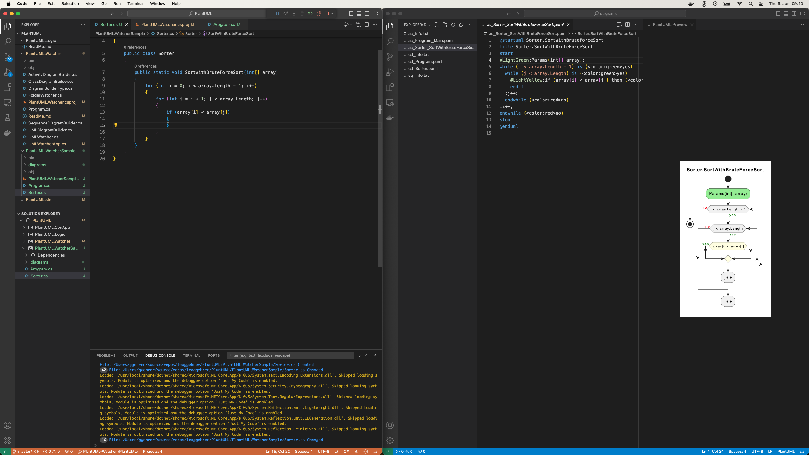
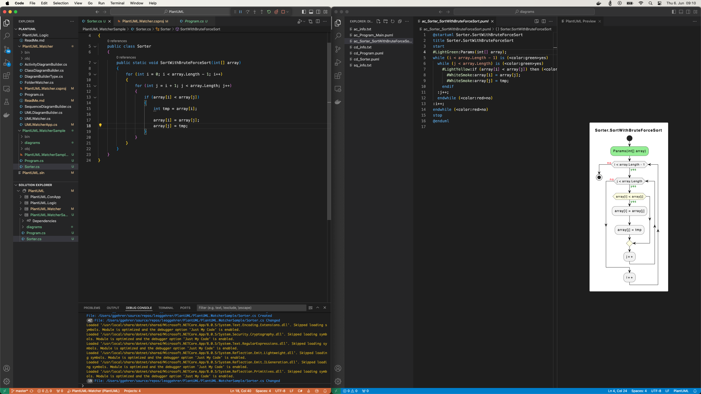

# Bedienungsanleitung für PlantUML.Watcher

## Projektbeschreibung

**PlantUML.Watcher** ist ein C#-Projekt, das verwendet wird, um UML-Diagramme automatisch zu erstellen und zu überwachen. Das Projekt überwacht die Änderungen in einem Verzeichnis (ein C# Projekt) und aktualisiert die UML-Diagramme entsprechend. Dadurch kann schon während der Entwicklung der Quellcode mit den UML-Diagrammen dokumentiert werden. Entsprechend der Einstellungen können folgende UML-Diagramme erstellt werden:

- Klassendiagramm
- Aktivitätsdiagramm
- Sequenzdiagramm

## Voraussetzungen

- **.NET SDK**: Stellen Sie sicher, dass das .NET SDK installiert ist. Sie können es von der [offiziellen .NET-Website](https://dotnet.microsoft.com/download) herunterladen.
- **IDE**: Eine integrierte Entwicklungsumgebung (IDE) wie Visual Studio oder Visual Studio Code wird empfohlen.
- Installierte **Extensions** für Visual Studio Code:
  - C# Dev Kit
  - Markdown All in One
  - PlantUML

## Installation - GitHub-Repository

1. **Projekt-Repository klonen**:

   ```bash
   git clone https://github.com/leoggehrer/PlantUML.git
   ```

2. **In das Projektverzeichnis wechseln**:

   ```bash
   cd PlantUML.Watcher/PlantUML.Watcher
   ```

3. **Abhängigkeiten wiederherstellen**:

   ```bash
   dotnet restore
   ```

**Verwendung:**

1. **Projekt kompilieren und ausführen**:

   ```bash
   dotnet run
   ```

## Installation - Nuget-Packages

1. Erstellen einer Konsolenanwendung (--name kann frei gewählt werden).

   ```bash
   dotnet new console --framework net8.0 --use-program-main --name UMLWatcher.ConApp
   ```

2. Anpassen der Projektdatei (UMLWatcher.ConApp.csproj)

   ```xml
   <Project Sdk="Microsoft.NET.Sdk">

   <PropertyGroup>
      <OutputType>Exe</OutputType>
      <TargetFramework>net8.0</TargetFramework>
      <ImplicitUsings>enable</ImplicitUsings>
      <Nullable>enable</Nullable>
   </PropertyGroup>

   <ItemGroup>
      <PackageReference Include="PlantUML.LiveGeneration" Version="1.0.2" />
   </ItemGroup>

   </Project>
   ```

3. Anpassen der Programmdatei (*Program.cs*)

   ```csharp
   namespace UMLWatcher.ConApp;

   class Program
   {
      static void Main(string[] args)
      {
         var app = new PlantUML.Watcher.UMLWatcherApp();

         app.Run(args);
      }
   }
   ```

**Verwendung:**

1. **In das Projektverzeichnis wechseln**:

   ```bash
   cd UMLWatcher.ConApp
   ```

2. **Projekt kompilieren und ausführen**:

   ```bash
   dotnet run
   ```

## Verwendung von PlantUML.Watcher

Zu Beginn wird das zu überwachende Projekt erstellt. Dies kann mit Visual Studio, Visual Studio Code oder in der Konsole erfolgen. Anschließend wird das Programm *PlantUML.Watcher* gestartet (falls das Programm noch nicht gestartet ist).

**Ausgangslage:**

- Überwachendes Projekt erstellt (in diesem Beispiel PlantUML.WatcherSample)
- *PlantUML.Watcher* wird ausgeführt

### Programmeinstellungen für *PlantUML.Watcher*

In diesem Abschnitt werden die wichtigsten Einstellungen von *PlantUML.Watcher* erläutert.

- [ 1] Force...Diese Einstellung erlaubt das überschreiben von Diagramm-Dateien (Einstellung: **True**)
- [ 5] Project path...Ändern des Projekt-Pfades (Einstellung: **../PlantUML.WatcherSample**)
- [ 7] Diagram folder...Mit dieser Option kann der Name für den Diagrammordner festgelegt werden (Einstellung: **diagrams**)
- [ 8] Diagram builder...Art der Diagramme welche erzeugt werden sollen (Einstellung: **All**)

Das sind die wichtigsten Einstellungen für das Arbeiten mit dem *PlantUML.Watcher*. Nun wird im Abschnitt **Projekte** das entsprechende Projekt ausgewählt, welches überwacht werden soll. In diesem Beispiel wird das Projekt **PlantUML.WatcherSample** ausgewählt. Dazu wird die Nummer **15** ausgewählt. Als Ergebnis wird ein **File-Watcher** gestartet welcher die Dateien in diesem Projekt überwacht und beim Auftreten von Änderungen die entsprechenden Diagramme erstellt. In der folgenden Abbildung wird ist der Dialog abgebildet.


**Hinweis:** Es können beliebig viele Projekte überwacht werden. Diese sollten allerdings vor Programmende beendet werden.

### Implementierung von **PlantUML.WatcherSample**

Zur Demonstration soll ein einfache Sortieralgorithmus implementiert werden. Sobald eine Änderung im Projekt ausgelöst wird, wird der *Watcher* aktiv und generiert die Diagramme mit dem aktuellen Quelldateien.


Im Projektordner wird vom *Watcher* der Ordner *diagrams* erstellt, in welchem die Diagramm-Dateien abgelegt werden. Die Bennenung der Diagramme erfolgt nach folgender Konvention:

- Klassendiagramme
  - **cd_Klasse.puml**

- Aktivitätsdiagramme
  - **ac_Klasse_Methode.puml**
  
- Sequenzdiagramme
  - **sq_Klasse_Methode.puml**

Falls mehrere Überladung von Methoden des gleichen Namens existieren, wird die Konvention mit einer Nummerierung ergänzt (z.B.: **'Klasse_Methode_1.puml'**).

### Live-Ansicht der Diagramme

In einer weiteren Instanz von Visual Studio Code kann die aktuelle Generierung der Diagramme angezeigt werden.


Dazu muss das aktuelle Diagramm in Visual Studio Code geöffnet und die entsprechende Vorschau aktiviert werden. Nun können die Änderungen in den Quelldateien mitverfolgt werden.


Jede Änderung in den Quelldateien führt zu einer neuen Generierung der Diagramme und somit zu einer Aktualisierung der grafischen Darstellung des Programmcodes.



In der obigen Abbildung ist das Hinzufügen der inneren *for*-Schleife im Diagramm dargestellt.



Zuletzt ist noch die Vertauschung der Array-Elemente hinzugefügt worden.

## Bekannte Probleme und Lösungen

- **Problem**: Die UML-Diagramme werden nicht erstellt oder aktualisiert.
- **Ursache A**: Der Watcher wurde nicht gestartet.
- **Lösung A**: Starten Sie in der Watcher-Konsole den Watcher für ihr Projekt.
- **Ursache B**: 'Auto Save' in Visual Studio Code ist nicht aktiviert.
- **Lösung B**: Aktivieren Sie die Funktion 'Auto Save' im Menü **File** oder Lösen Sie die Speicherung manuell aus (STRG + S).
- **Problem**: Das UML-Diagramm wird nicht angezeigt.
- **Lösung**: Überprüfen Sie, ob die Erweiterung **PlantUML** installiert ist.
